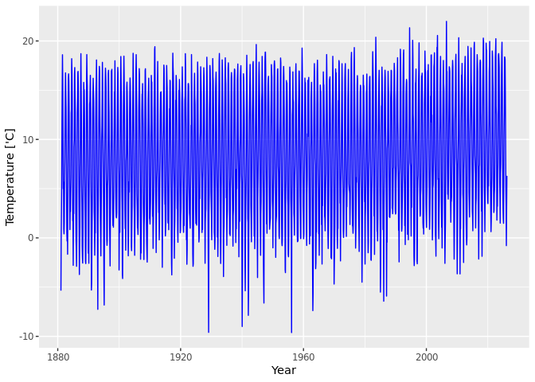

## DWD Temperature

Download the temperature data from dwd (monthly & regional summary)


```sh

for month in "01" "02" "03" "04" "05" "06" "07" "08" "09" "10" "11" "12"
do
 file="regional_averages_tm_$month.txt"
 echo "Download file: $file"
 [ -f ./download/$file ] && mv -f ./download/$file ./download/$file.bck
 wget -q -P download https://opendata.dwd.de/climate_environment/CDC/regional_averages_DE/monthly/air_temperature_mean/$file
 ## Remove first line !!
 tail -n +2 ./download/$file > ./download/$file.tmp && mv ./download/$file.tmp ./download/$file
done
```

```
## Download file: regional_averages_tm_01.txt
## Download file: regional_averages_tm_02.txt
## Download file: regional_averages_tm_03.txt
## Download file: regional_averages_tm_04.txt
## Download file: regional_averages_tm_05.txt
## Download file: regional_averages_tm_06.txt
## Download file: regional_averages_tm_07.txt
## Download file: regional_averages_tm_08.txt
## Download file: regional_averages_tm_09.txt
## Download file: regional_averages_tm_10.txt
## Download file: regional_averages_tm_11.txt
## Download file: regional_averages_tm_12.txt
```


```r
temp <- read.csv("./download/regional_averages_tm_01.txt", sep=";")

for (month in c("02","03","04","05","06","07","08","09","10","11","12")){
  file <- paste("./download/regional_averages_tm_", month, ".txt", sep="")
  print(paste("Reading file:", file))
  tmp <- read.csv(file, sep=";")
  temp <- rbind(temp, tmp)
}
```

```
## [1] "Reading file: ./download/regional_averages_tm_02.txt"
## [1] "Reading file: ./download/regional_averages_tm_03.txt"
## [1] "Reading file: ./download/regional_averages_tm_04.txt"
## [1] "Reading file: ./download/regional_averages_tm_05.txt"
## [1] "Reading file: ./download/regional_averages_tm_06.txt"
## [1] "Reading file: ./download/regional_averages_tm_07.txt"
## [1] "Reading file: ./download/regional_averages_tm_08.txt"
## [1] "Reading file: ./download/regional_averages_tm_09.txt"
## [1] "Reading file: ./download/regional_averages_tm_10.txt"
## [1] "Reading file: ./download/regional_averages_tm_11.txt"
## [1] "Reading file: ./download/regional_averages_tm_12.txt"
```

```r
temp <- temp[order(temp$Jahr, temp$Monat),]
names(temp)[names(temp) == "Jahr"] <- "year"
names(temp)[names(temp) == "Monat"] <- "month"
temp$ts <- signif(temp$year + (temp$month-0.5)/12, digits=6)
temp$time <- paste(temp$year,temp$month, '15 00:00:00', sep='-')
temp$X <- NULL

write.table(temp, file = "csv/monthly_temperature_de.csv", append = FALSE, quote = TRUE, sep = ",",
            eol = "\n", na = "NA", dec = ".", row.names = FALSE,
            col.names = TRUE, qmethod = "escape", fileEncoding = "UTF-8")
```


## Plot Temperature


```r
require("ggplot2")
```

```
## Loading required package: ggplot2
```

```r
temp <- read.csv("./csv/monthly_temperature_de.csv", sep=",")
mp <- ggplot() +
      geom_line(aes(y=temp$Deutschland, x=temp$ts), color="blue") +
      xlab("Year") + ylab("Temperature ['C]")
mp
```

<!-- -->


